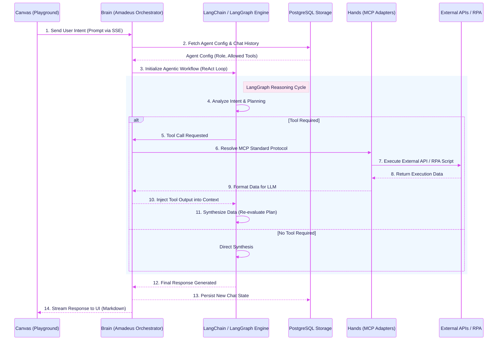
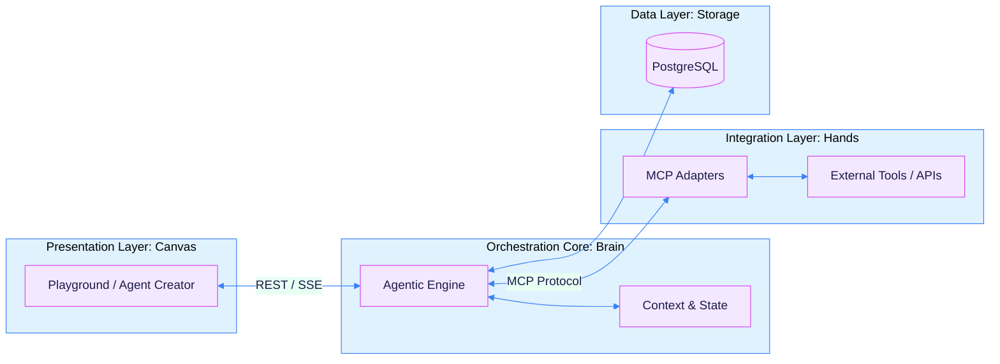
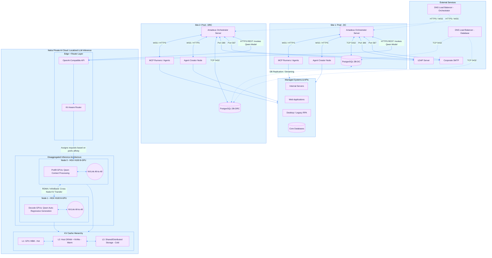
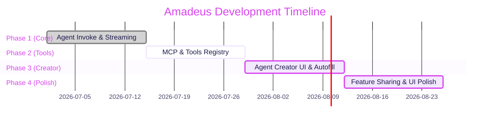

# Amadeus Platform: 4D Lifecycle

Amadeus is an orchestration platform designed to seamlessly integrate intelligent Agentic capabilities with deterministic tools and external APIs. This document outlines the project's journey through the 4D Lifecycle: Discover, Design, Develop, and Deploy.

---

## A. Discover -> Problem & Solution

### Why we need this? (The Philosophy)
**Human. AI Agent. Robot.**

**Humans** want automation, but humans also demand compliance.  
**AI Agents** want to automate. They connect to applications via MCP (Model Context Protocol), which requires an API Key. But not all applications have API keys available due to compliance restrictions. This results in *high automation, less compliance, and restricted access.*  
**Robots** want to automate too, but within compliance. They connect to applications via UI without API keys. This results in *high compliance, less automation*. But robots cannot talk to each other, nor can they talk to humans.

This creates disorganization between automated business processes. Where humans are fully replaced by AI, *wallahi we’re doomed.* AI doesn’t fix a disorganized company—it turns your disorganization into a system.

### The Data-Driven Reality
**Your roadmap to enterprise-ready APA.**

> 📊 *“More than 90% of so-called ‘agentic’ AI solutions are simply repackaged generative AI layered atop legacy systems, with only around 130 vendors among thousands actually delivering genuine agent-driven orchestration, according to Gartner.”*

**A Practical Playbook for Enterprise-Ready Automation**
- **Ask Yourself:** Are you Solving Problems or Just Chasing AI?
- **Assess:** How to Define an APA Maturity Model.
- **Execute:** How to Make Your Business Case for APA Investment.

While competitors struggle to bridge the gap, enterprise architects recognize the need for mature orchestration. As Venkata K., Solution Architect at CMG Mortgage, Inc., noted:
> 🗣️ *"We also explored Microsoft’s Power Automate. However, it wasn’t as mature or up to enterprise level at the time. Automation Anywhere had good standards and excellent support, in terms of architecture, design, and user interface, we chose Automation Anywhere. It also has good community support."*

The industry demands the maturity and stability of legacy RPA, combined with genuine agentic intelligence.

### What we gonna do? (The Solution: Amadeus)
**Humans Whoops. Agents Loop. Robots Shoot.**

Prompt Engineering is Outdated. Welcome to the **Loop Era**. Talk once, let agents decide. Enterprise-grade critical tasks are executed by Robots and orchestrated by AI Agents.

So, **RPA + Agents = APA (Agentic Process Automation)**.

We are building **Amadeus**, a central orchestration platform bridging this exact gap through:
1. **Agent Creator**: Allowing users to seamlessly design and configure intelligent agents.
2. **Tools Registry**: A centralized hub to register and manage capabilities (APIs, scripts).
3. **Agent Invoke**: A dynamic playground where agents can be summoned to execute tasks by reasoning and utilizing the attached tools.

### Objective Benchmark: Amadeus APA vs. Traditional RPA (e.g., Automation Anywhere)
*Playing devil's advocate: Where do we shine, and where do we fall short?*

| Feature / Aspect | 🤖 Traditional RPA (Automation Anywhere) | 🧠 Amadeus APA (Agentic Process Automation) |
| :--- | :--- | :--- |
| **Core Paradigm** | **Deterministic & Rules-Based.** Strict step-by-step logic. AI is treated as an add-on (Copilot). | **AI-Native & Intent-Based.** Agents reason the best path to execute deterministic tools. |
| **Development Speed** | **Slow.** Requires specialized RPA developers, rigid scripting, and complex UI mapping. | **Fast.** "Talk once, let agents decide." Natural language configuration via Agent Creator. |
| **Handling Unstructured Data** | **Rigid.** Relies on specialized document templates (IQ Bot). Fails when formats change. | **Highly Flexible.** LLMs natively understand context, parsing messy data seamlessly. |
| **Predictability & Compliance** | 🥇 **Superior.** 100% deterministic execution. Extremely robust audit trails; enterprise compliance is built-in. | ⚠️ **Challenging.** Agents can hallucinate or take unpredictable paths. Compliance relies heavily on strictly defined MCP limits. |
| **Integration Ecosystem** | 🥇 **Superior.** Decades of mature, enterprise-certified connectors (SAP, Oracle, Mainframes). | ⚠️ **Developing.** Highly extensible via MCP, but currently lacks the massive library of legacy system connectors. |

**Verdict:** Amadeus is not here to replace Automation Anywhere. We are here to **orchestrate** it. Amadeus acts as the intelligent "Brain" that can call existing RPA bots as its "Hands" via MCP, turning rigid automation into an adaptive, intelligent system.

### Detailed Agent Invoke & Orchestration Flow

---

## B. Design -> System Architecture

Our architecture is strictly divided into four specialized layers to ensure scalability and separation of concerns.

### 1. Presentation Layer -> Canvas (Front End)
The interactive interface where users configure agents and test them.
- **Tech**: React, Next.js, Tailwind CSS, React Flow.
- **Features**: Agent Creator UI, Interactive Playground (Agent Invoke), Streaming Chat UI.

### 2. Orchestration Core -> Brain (Back End)
The reasoning engine that manages agent states and tool selection.
- **Tech**: Node.js, Fastify, LangChain/LangGraph.
- **Features**: LLM Routing, Session Memory, Agent Configuration processing.

### 3. Integration Layer -> Hands (API Gateway, MCP)
The standardized protocol layer for tool execution.
- **Tech**: Model Context Protocol (MCP).
- **Features**: Standardized tool execution, dynamic tool discovery, external API bridging.

### 4. Data Layer -> Storage (Database)
The persistent memory and configuration storage.
- **Tech**: PostgreSQL.
- **Features**: Storing Agent configurations, Tool schemas, Chat history, and Feature Sharing links.

### System Architecture Flowchart

### Enterprise DC / DRC Infrastructure Topology

---

## C. Develop -> Roadmap

The development of the platform is divided into iterative sprints focusing on core agent capabilities.

### Sprints & Feature Planning
- **Sprint 1: Core Orchestration**
  - Establish base LLM connectivity and streaming (SSE) capabilities.
  - Basic Agent Invoke interface.
- **Sprint 2: The "Hands" (Tool Integration)**
  - Implement MCP Adapters.
  - Build the Tools registry and enable dynamic tool calling from the Agent Invoke playground.
- **Sprint 3: The "Canvas" (Agent Creator)**
  - Develop the Agent Creator interface.
  - Implement intelligent field autofill and configuration saving.
- **Sprint 4: Ecosystem & Collaboration (Bonus)**
  - Feature Sharing (sharing agents/threads with other users).
  - UI Polish and Markdown/Table rendering enhancements.

### Timeline

---

## D. Deploy -> Test, Proof-of-Concept, Piloting Usecases

### Where we lie in the current condition?
We sit exactly at the bridge between **unstructured conversational AI** (like standard ChatGPT) and **rigid robotic process automation** (like legacy RPA). Amadeus provides the reasoning of the former with the deterministic execution of the latter.

### Piloting Usecase Examples

**Automated CX100 Danantara Survey Loop**
- **Scenario**: End-to-end automation of the Danantara survey and queue transaction process via the CX100 legacy application.
- **Execution**: The Agent (Brain) is configured with the *Danantara Survey Loop* recipe. It autonomously orchestrates a multi-step deterministic workflow: it triggers the initial `Danantara_LoginFlow` via RPA, waits for verification (OTP/Login resolution), and executes the transaction ("Buka aplikasi CX100, buat transaksi baru dengan nomor antrian berikutnya, lalu tutup"). This proves Amadeus's ability to wrap rigid, multi-stage legacy RPA scripts inside a resilient, state-aware agentic loop without losing track of context.
