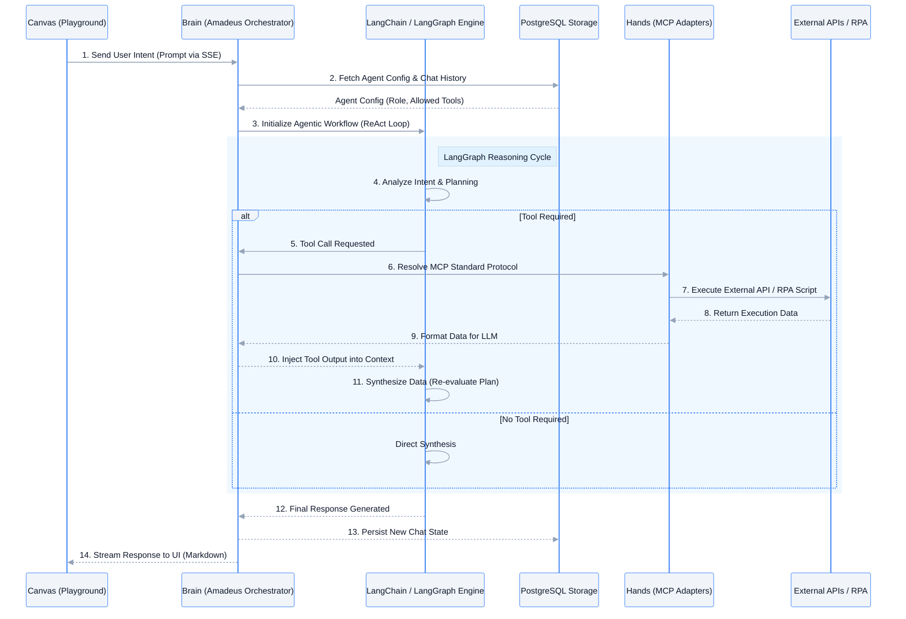
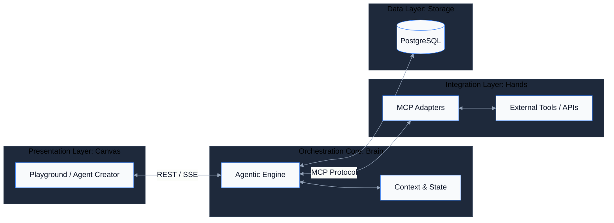
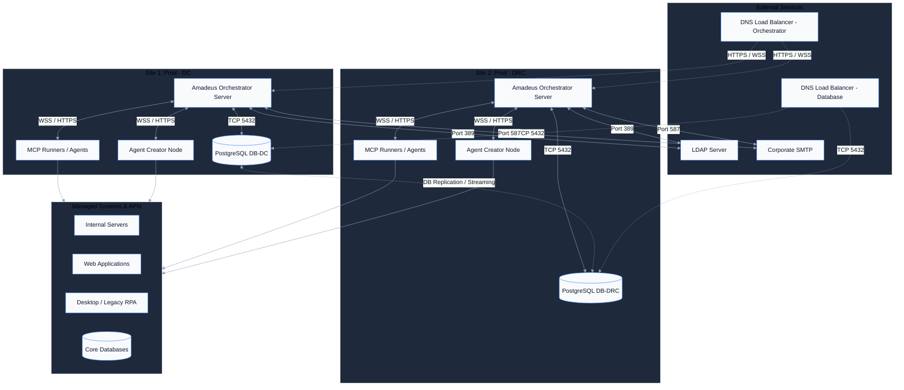
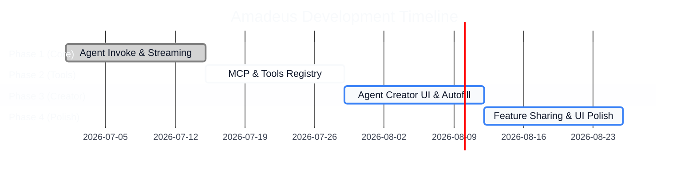

# Amadeus Platform: 4D Lifecycle

Amadeus is an orchestration platform designed to seamlessly integrate intelligent Agentic capabilities with deterministic tools and external APIs. This document outlines the project's journey through the 4D Lifecycle: Discover, Design, Develop, and Deploy.

---

## A. Discover -> Problem & Solution

### Why we need this? (Why?)
Organizations currently struggle with isolated automation bots and disconnected LLM models. While LLMs excel at reasoning, they lack the "hands" to execute actions. Conversely, traditional APIs and RPA bots can execute actions but lack the "brain" to reason dynamically. We need a unified platform where intelligent agents can dynamically select and use tools to solve complex user intents without hardcoded flows.

### What we gonna do? (What?)
We are building **Amadeus**, a central orchestration platform centered around:
1. **Agent Creator**: Allowing users to seamlessly design and configure intelligent agents.
2. **Tools Registry**: A centralized hub to register and manage capabilities (APIs, scripts).
3. **Agent Invoke**: A dynamic playground where agents can be summoned to execute tasks by reasoning and utilizing the attached tools.

### Detailed Agent Invoke & Orchestration Flow

---

## B. Design -> System Architecture

Our architecture is strictly divided into four specialized layers to ensure scalability and separation of concerns.

### 1. Presentation Layer -> Canvas (Front End)
The interactive interface where users configure agents and test them.
- **Tech**: React, Next.js, Tailwind CSS, React Flow.
- **Features**: Agent Creator UI, Interactive Playground (Agent Invoke), Streaming Chat UI.

### 2. Orchestration Core -> Brain (Back End)
The reasoning engine that manages agent states and tool selection.
- **Tech**: Node.js, Fastify, LangChain/LangGraph.
- **Features**: LLM Routing, Session Memory, Agent Configuration processing.

### 3. Integration Layer -> Hands (API Gateway, MCP)
The standardized protocol layer for tool execution.
- **Tech**: Model Context Protocol (MCP).
- **Features**: Standardized tool execution, dynamic tool discovery, external API bridging.

### 4. Data Layer -> Storage (Database)
The persistent memory and configuration storage.
- **Tech**: PostgreSQL.
- **Features**: Storing Agent configurations, Tool schemas, Chat history, and Feature Sharing links.

### System Architecture Flowchart

### Enterprise DC / DRC Infrastructure Topology

---

## C. Develop -> Roadmap

The development of the platform is divided into iterative sprints focusing on core agent capabilities.

### Sprints & Feature Planning
- **Sprint 1: Core Orchestration**
  - Establish base LLM connectivity and streaming (SSE) capabilities.
  - Basic Agent Invoke interface.
- **Sprint 2: The "Hands" (Tool Integration)**
  - Implement MCP Adapters.
  - Build the Tools registry and enable dynamic tool calling from the Agent Invoke playground.
- **Sprint 3: The "Canvas" (Agent Creator)**
  - Develop the Agent Creator interface.
  - Implement intelligent field autofill and configuration saving.
- **Sprint 4: Ecosystem & Collaboration (Bonus)**
  - Feature Sharing (sharing agents/threads with other users).
  - UI Polish and Markdown/Table rendering enhancements.

### Timeline

---

## D. Deploy -> Test, Proof-of-Concept, Piloting Usecases

### Where we lie in the current condition?
We sit exactly at the bridge between **unstructured conversational AI** (like standard ChatGPT) and **rigid robotic process automation** (like legacy RPA). Amadeus provides the reasoning of the former with the deterministic execution of the latter.

### Piloting Usecase Examples

**Automated CX100 Danantara Survey Loop**
- **Scenario**: End-to-end automation of the Danantara survey and queue transaction process via the CX100 legacy application.
- **Execution**: The Agent (Brain) is configured with the *Danantara Survey Loop* recipe. It autonomously orchestrates a multi-step deterministic workflow: it triggers the initial `Danantara_LoginFlow` via RPA, waits for verification (OTP/Login resolution), and executes the transaction ("Buka aplikasi CX100, buat transaksi baru dengan nomor antrian berikutnya, lalu tutup"). This proves Amadeus's ability to wrap rigid, multi-stage legacy RPA scripts inside a resilient, state-aware agentic loop without losing track of context.
