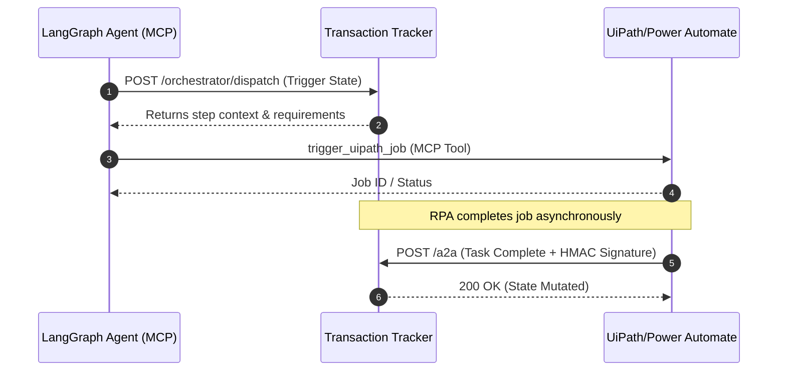

The **Agent-to-Agent (A2A)** protocol is Amadeus’s proprietary standard for coordinating heterogeneous actors—LLM reasoning engines, RPA robots (UiPath, Power Automate), and Human checkers—around a single immutable state machine within the `transaction_tracker`.

## Core Protocol Architecture

Amadeus implements two operational versions of the A2A protocol. Both are actively supported by the tracker engine to ensure backward compatibility with older RPA bot deployments.



---

## Protocol v1: JSON-RPC 2.0 (`amadeus.a2a/1`)

The modern standard utilizing the robust JSON-RPC 2.0 envelope format. All requests are sent to `POST /a2a/rpc`.

### Supported RPC Methods

- `task.submit` — Submit a task completion payload for a specific `(transactionId, step)`. Returns a `taskId` and the initial `state`.
- `task.get` — Long-poll or check a task's current state.
- `task.cancel` — Gracefully terminate a pending asynchronous task.
- `task.provideInput` — Supply human-in-the-loop (HITL) input for a task blocked in the `input_required` state.
- `agent.card` — Discover orchestrator capabilities (see below).

> [!NOTE]  
> The `task.submit` payload securely encapsulates the financial HMAC signature inside the RPC `params` block, ensuring it is preserved across network proxies.

---

## Protocol v0: Envelope Style (`amadeus.a2a/0`)

The legacy flat-envelope standard. Used extensively by older `amadeus-mcp` implementations and the frontend A2A dashboard tab. Sent to `POST /a2a`.

```json
{
  "protocol": "amadeus.a2a/0",
  "type": "task.complete",
  "transactionId": "tx_abc123",
  "step": "mt_converted",
  "idempotencyKey": "idem_789",
  "correlationId": "agent_alpha",
  "reason": "Successfully converted MT202 Swift message.",
  "data": {},
  "sentAt": "2026-07-06T05:06:24.803Z"
}
```

The `type` field acts as the RPC method analog, supporting: `task.assign`, `task.complete`, `task.failed`, and `task.status`.

---

## Agent Card Discovery

To allow external third-party tools to dynamically integrate, the tracker exposes an unauthenticated discovery route:

`GET /.well-known/amadeus-agent-card.json`

This card advertises supported authentication schemes (`robot_key`, `hmac_signature`, `oauth2_client_credentials`), eliminating integration guesswork.

---

## The Cryptographic Signature Layer

To ensure absolute zero-trust security between the transaction ledger and the execution agents, **Financial Steps** (`mt_converted`, `swift_released`, `settled`) mandate an HMAC-SHA512 cryptographic signature in addition to standard `X-Robot-Key` authentication.

### Construction

```text
canonical_string = METHOD \n PATH \n TIMESTAMP \n sha256(body)
signature        = HMAC-SHA512(key, canonical_string)

// Key Derivation:
key              = signing_secret                        (if SIGNATURE_PEPPER unset)
key              = `${signing_secret}:${SIGNATURE_PEPPER}` (if configured)
```

### Transport Headers (v0)

- `X-Signature`: The computed HMAC signature (Hex string).
- `X-Robot-Timestamp`: Unix epoch in seconds. (Validated against `SIGNATURE_MAX_SKEW_SEC` to prevent replay attacks).
- `X-Robot-Signing-Secret`: The cleartext secret used to authorize the signature. 
  *(The server rapidly hashes this via Argon2 and compares it against the database. Migration to OAuth2/mTLS is on the roadmap.)*

> [!CAUTION]
> **The `SIGNATURE_PEPPER` Failure Mode:** 
> If the `transaction_tracker` has `AMADEUS_SIGNATURE_PEPPER` set, every agent (e.g., `amadeus-mcp`) must have identical environment configuration. If it is missing from the client, the HMAC computation will fail silently and the server will return `SIGNATURE_REQUIRED`.
