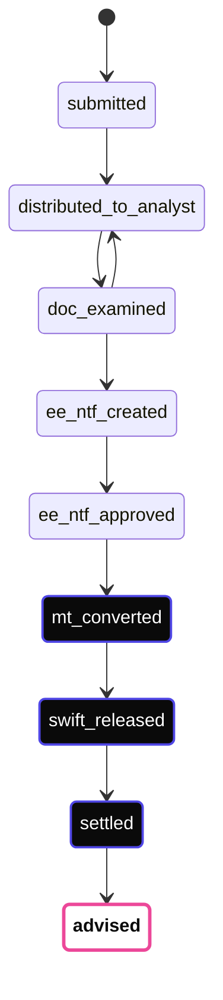
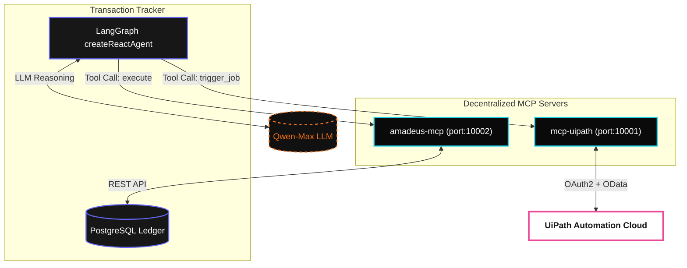

Amadeus is an enterprise-grade Conversational Orchestration platform built on a modern, deeply-integrated **TypeScript / Node.js** stack. It leverages **LangGraph** for deterministic agentic reasoning and the **Model Context Protocol (MCP)** for seamless Agent-to-Agent (A2A) tool execution.

This documentation serves as the source of truth for the Amadeus architecture.

> [!NOTE]
> All legacy Python components have been entirely deprecated in favor of this unified, high-performance TypeScript architecture.

---

## The Core Stack

The Amadeus platform consists of three primary layers operating in an air-gapped or localized on-premise environment:

1. **Next.js Console (Frontend)**: A high-contrast, professional-grade observability layer for monitoring state machine transitions and agent invocations in real time.
2. **Transaction Tracker (Backend)**: A Fastify + PostgreSQL orchestrator running on Port `8080`. It manages immutable audit trails, cryptographic idempotency, and the LangGraph execution engine.
3. **MCP Tool Servers**: Decentralized worker services (`amadeus-mcp`, `mcp-uipath`) that expose REST APIs and RPA workflows to the LangGraph agents via SSE/stdio transports.

---

## Data-Driven State Machine

The backbone of the Amadeus orchestrator is a strict, data-driven state machine (`stepFlows.ts`). It enforces immutable progression of transactions without hardcoded flow logic.

Below is the execution graph for the **Import LC Settlement** flow:



> [!IMPORTANT]  
> Financial steps (`mt_converted`, `swift_released`, `settled`) mandate an HMAC-SHA512 cryptographic signature layer to guarantee non-repudiation between the agent and the transaction ledger.

---

## Universal LangGraph Engine

Unlike rigid automation scripts, Amadeus embeds a **Universal LangGraph Engine** inside the `transaction_tracker`. This enables dynamic, context-aware reasoning for every step.

We utilize `@langchain/langgraph/prebuilt` to instantiate `createReactAgent` dynamically based on the transaction's designated persona and dynamically assigned MCP tools.

### Exact Engine Implementation (`engine.ts`)

```typescript
import { createReactAgent } from "@langchain/langgraph/prebuilt";
import { ChatOpenAI } from "@langchain/openai";

// 1. Initialize the LLM (e.g., Qwen-Max)
const llm = new ChatOpenAI({
  modelName: process.env.QWEN_LLM_MODEL || "qwen-max",
  temperature: 0,
});

// 2. Instantiate the LangGraph Agent In-Memory
// 'tools' are dynamically resolved from the MCP Server adapters
const agent = createReactAgent({
  llm,
  tools, 
  stateModifier: agentConfig.agent_style || "You are a helpful assistant.",
});

// 3. Invoke LangGraph with full transaction context
const result = await agent.invoke({
  messages: [{ role: "user", content: `Execute step ${step} for transaction ${txId}` }]
});
```

### The Agent & MCP Architecture

Here is how the LangGraph Agent Engine interacts with the MCP Transports:



When accessed via the **Playground** surface, this engine utilizes `agent.stream({ streamMode: "values" })` to pipe LLM reasoning tokens and tool-call states over Server-Sent Events (SSE) directly to the Next.js UI in real time.

---

## Model Context Protocol (MCP)

To maintain absolute security and modularity, Amadeus agents **do not execute business logic directly**. Instead, they emit tool calls that are routed through standard MCP Transports.

- **`mcp-uipath`**: Connects via SSE. Performs OAuth2 client-credentials authentication against UiPath Automation Cloud to trigger jobs and poll execution statuses without exposing credentials to the LLM.
- **`amadeus-mcp`**: Provides the agent with localized read/write access to the transaction tracker database (e.g., pulling transaction context or completing a step).

---

## Where to go next

Explore the detailed mechanics of the Amadeus TS architecture:

- [The LC Settlement Stack](/docs/lc-settlement-stack)
- [A2A Protocol & Signatures](/docs/a2a-protocol)
- [Cost-Aware Routing](/docs/cost-aware-routing)
