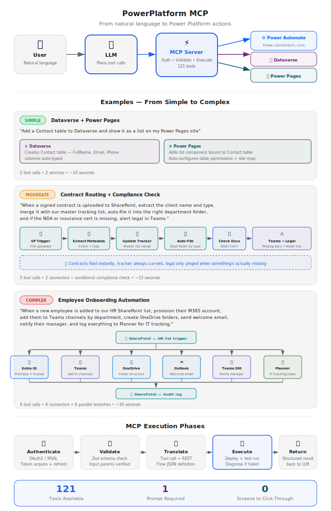

# Power Platform MCP Server

**Docs:** **Overview** · [Installation & Upgrading](https://github.com/rcb0727/powerautomate-mcp-docs/blob/main/INSTALL.md) · [Changelog](https://github.com/rcb0727/powerautomate-mcp-docs/blob/main/CHANGELOG.md) · [Report an issue](https://github.com/rcb0727/powerautomate-mcp-docs/issues)

An MCP (Model Context Protocol) server for Microsoft Power Platform. Create, manage, and deploy Power Automate flows using natural language amd more. 

Works with any MCP-compatible AI client: **Claude Desktop**, **Claude Code**, **VS Code Copilot**, **Cursor**, **Google Gemini CLI**, and more.

## Documentation Map

| Page | What you'll find |
|------|------------------|
| **README** (this page) | [Features](#features) · [Quick Start](#quick-start) · [App Registration](#microsoft-entra-app-registration) · [CLI Reference](#cli-reference) · [How It Works](#how-it-works) · [All 121 Tools](#available-tools-121-total) · [Security](#security) · [Architecture](#architecture) |
| [Installation Guide](https://github.com/rcb0727/powerautomate-mcp-docs/blob/main/INSTALL.md) | [Choose your path](https://github.com/rcb0727/powerautomate-mcp-docs/blob/main/INSTALL.md#choose-your-path) · [Easy Path](https://github.com/rcb0727/powerautomate-mcp-docs/blob/main/INSTALL.md#easy-path-3-steps) · [Fast Path](https://github.com/rcb0727/powerautomate-mcp-docs/blob/main/INSTALL.md#fast-path-developers) · [Connect your AI app](https://github.com/rcb0727/powerautomate-mcp-docs/blob/main/INSTALL.md#connecting-your-ai-app) · [**Updating**](https://github.com/rcb0727/powerautomate-mcp-docs/blob/main/INSTALL.md#updating) · [Troubleshooting](https://github.com/rcb0727/powerautomate-mcp-docs/blob/main/INSTALL.md#troubleshooting) · [Glossary](https://github.com/rcb0727/powerautomate-mcp-docs/blob/main/INSTALL.md#glossary) · [Admin & enterprise](https://github.com/rcb0727/powerautomate-mcp-docs/blob/main/INSTALL.md#admin--enterprise-setup) |
| [Changelog](https://github.com/rcb0727/powerautomate-mcp-docs/blob/main/CHANGELOG.md) | Release history with per-version upgrade notes |
| [Issues](https://github.com/rcb0727/powerautomate-mcp-docs/issues) | Bug reports and feature requests — every one gets read |

## Features

- **Create Flows** - Build flows from natural language descriptions with guided wizard
- **Test & Debug** - Automatic testing with intelligent error diagnosis
- **Validate** - Pre-flight checks with best practices scoring (0-100)
- **Manage Flows** - List, update, clone, and delete flows
- **Power Apps** - Manage canvas and model-driven apps, permissions, versions
- **Power Pages** - Configure sites (pages, web roles, table permissions, snippets, templates) and manage hosting (provision, restart, delete)
- **Environment Admin** - Create, copy, backup, restore environments
- **DLP Policies** - Create and manage data loss prevention policies
- **Solutions ALM** - Export, import, and manage Dataverse solutions
- **Dataverse CRUD** - Full table/row operations via OData Web API
- **SharePoint** - Sites, lists, items, and files via Microsoft Graph
- **Expression Help** - Interactive Power Automate expression reference
- **Connector Intelligence** - Full knowledge of 400+ connectors and schemas
- **Cross-Platform** - Works on Windows, macOS, and Linux

## Quick Start

Three commands — run them in a terminal:

```bash
npm install -g powerautomate-mcp   # 1. install
powerautomate-mcp --setup          # 2. sign in + connect your AI app
powerautomate-mcp --doctor         # 3. confirm everything works
```

The `--setup` wizard does it all: lets you choose a least-privilege permission set, creates the Entra app registration (or takes one you provide), signs you in, handles admin consent, picks your environment, **and wires the server into your AI app for you** — no hand-editing JSON. Then restart your app and ask it to build a flow.

**Not very technical?** Follow the step-by-step **[Easy Path](https://github.com/rcb0727/powerautomate-mcp-docs/blob/main/INSTALL.md#easy-path-3-steps)** with checkpoints.

| Want to… | Do this |
|----------|---------|
| Connect a specific app during setup | `powerautomate-mcp --setup --client claude` |
| Connect an app later (or a second one) | `powerautomate-mcp --client cursor` |
| Skip the global install | `npx -y powerautomate-mcp@latest --setup` (add `--npx` so your app uses npx too) |
| Configure your app by hand | [Manual client configs](https://github.com/rcb0727/powerautomate-mcp-docs/blob/main/INSTALL.md#connect-your-ai-app-manually) |

Supported apps: **Claude Desktop**, **Claude Code**, **Cursor**, **VS Code (Copilot)**, **Gemini CLI**, **Windsurf**, **ChatGPT** (via `--http`).

---

## Microsoft Entra App Registration

The setup wizard (`--setup`) creates the app registration automatically if you have Azure CLI installed. No manual steps required for most users.

> **New tenants work too** (v0.13.0+): if your tenant has never used Power Platform, setup creates the missing first-party service principals and resolves the permission ids your tenant actually publishes — the old `AADSTS650052` / `AADSTS65006` sign-in failures repair themselves on a re-run of `--setup`.

### Who Needs to Do What?

| Role | Action |
|------|--------|
| Entra ID admin with Azure CLI | Run `powerautomate-mcp --setup` — everything is automated |
| Entra ID admin without Azure CLI | Run `--setup`, paste your app's Client ID when prompted, grant admin consent |
| Non-admin user | Run `--setup`, then ask an admin (see roles below) to approve the consent URL shown |
| End users (after admin setup) | Just run `powerautomate-mcp --setup` |

> **Tip:** You can also set `PA_MCP_CLIENT_ID` as an environment variable to skip the prompt entirely.

### Admin Consent

When the Azure CLI is signed in as an admin, the wizard offers to grant tenant-wide consent directly (v0.13.0+) — no browser round-trip. Otherwise it presents the admin consent URL and auto-opens it in your browser. Any of these Entra ID roles can grant consent: **Global Administrator**, **Application Administrator**, **Cloud Application Administrator**, or **Privileged Role Administrator**. If you don't have one of these roles, share the URL with your admin:

```
https://login.microsoftonline.com/{tenant-id}/adminconsent?client_id=YOUR_CLIENT_ID
```

### Manual Setup (Optional)

If you prefer to create the app registration manually:

1. Go to [Azure Portal](https://portal.azure.com) > **Microsoft Entra ID** > **App registrations** > **New registration**

2. Configure basic settings:
   - **Name**: `Power Automate MCP`
   - **Supported account types**: Accounts in any organizational directory (multi-tenant)
   - **Redirect URI**: Select "Public client/native" and enter:
     ```
     https://login.microsoftonline.com/common/oauth2/nativeclient
     ```

3. After creation, go to **Authentication** and enable:
   - **Allow public client flows**: Yes

4. Go to **API permissions** > **Add a permission** and add only the permissions for the tool surfaces you want to enable. The setup wizard offers presets for **All tool surfaces**, **Power Automate only**, **Power Automate + connectors**, **Dataverse**, **Power Pages**, and **Custom**.

   | API | Permission | Type | Used For |
   |-----|------------|------|----------|
   | Power Automate (Flow Service) | `Flows.Read.All` | Delegated | Read flows |
   | Power Automate (Flow Service) | `Flows.Manage.All` | Delegated | Create/update/delete flows |
   | Power Automate (Flow Service) | `Activity.Read.All` | Delegated | Flow run history |
   | Power Automate (Flow Service) | `Approvals.Manage.All` | Delegated | Approval management |
   | Microsoft Graph | `User.Read`, `Sites.ReadWrite.All`, `Files.ReadWrite.All` | Delegated | Optional: SharePoint, OneDrive, and Excel helpers |
   | PowerApps Service | `User` | Delegated | Optional: connections, connector metadata, custom connectors, and Power Apps maker APIs |
   | BAP Admin API | `user_impersonation` | Delegated | Optional: admin tools, Dataverse URL discovery, and Power Pages configuration |
   | Dynamics CRM | `user_impersonation` | Delegated | Optional: Dataverse table/row CRUD and Power Pages configuration |
   | Power Platform API | delegated permission | Delegated | Optional: Power Pages **site management** (Tier 2 — see note below) |

   > **Least privilege:** Power Automate-only setups need only the Flow Service permissions. Skipped feature scopes are saved in `features.enabled`, hidden from the advertised MCP tool list, and skipped by `--doctor` / `--validate`.

   > **Dataverse and admin tools** require the BAP Admin API delegated permission (appId `0e0bf3cc-3078-4fd4-9ef3-cb6dc0245b10`). Without it, the server cannot resolve the real Dataverse org URL and falls back to a guessed `*.crm.dynamics.com` hostname that often fails DNS.

   > **Power Pages site-management tools (Tier 2)** call `https://api.powerplatform.com` and need the "Power Platform API" delegated permission (appId `8578e004-a5c6-46e7-913e-12f58912df43`). It is **not** added by the automatic `--setup` app creation because that API exposes only feature-scoped permissions and the auto-creator can't safely guess the scope. Add it manually here if you want Tier 2; the Power Pages **config** tools (Dataverse) work without it. After adding, re-run `--setup` — the wizard reports whether the Power Platform API authorized.

5. Click **Grant admin consent for [Your Tenant]** (requires Global Admin, Application Admin, Cloud Application Admin, or Privileged Role Admin)

---

## CLI Reference

```
powerautomate-mcp [options]
```

| Flag | Description |
|------|-------------|
| `--setup`, `-s` | Run the interactive setup wizard (signs in + connects your AI app) |
| `--doctor` | Check your setup and print exactly what to fix, then exit |
| `--validate` | Verify config, auth, and API connectivity then exit |
| `--client <name>` | Wire an AI app's config to this server, then exit (`claude`, `claude-code`, `cursor`, `vscode`, `gemini`, `windsurf`) |
| `--npx` | With `--setup`/`--client`, configure the app to run via `npx` (no global install) |
| `--update` | Check for updates and install the latest version |
| `--version`, `-v` | Print version and exit |
| `--http` | Start with Streamable HTTP transport |
| `--port <N>` | Port for HTTP transport (default: 3000) |
| `--env <name>` | Override the default environment (alias or GUID) |
| `--config <path>` | Use an alternate config file |
| `--debug` | Enable debug-level logging |
| `--help`, `-h` | Show help message |

**Environment Variables:**
| Variable | Description |
|----------|-------------|
| `PA_MCP_CLIENT_ID` | Microsoft Entra app client ID (overrides config file) |
| `PA_CONFIG_PATH` | Custom path to config.json |

---

## How It Works

<p align="center">
  
</p>

---

### More Example Prompts

<details>
<summary>Flows</summary>

```
Create a flow that sends me an email every morning with the weather forecast
```
```
Test my "Daily Report" flow and tell me if there are any errors
```
```
Help me write an expression to format a date as "January 1, 2024"
```
```
Show me all the flows that have been shared with me
```
```
Patch the "Compose" action inside the Default case of "If_Recognized_Form" — only that one node, leave the rest alone
```

</details>

<details>
<summary>SharePoint</summary>

```
List all items in the "Projects" list on our Marketing site
```
```
Upload this month's report to the Shared Documents library
```

</details>

<details>
<summary>Dataverse</summary>

```
Show me all active accounts in Dataverse with revenue over $1M
```
```
Create a new contact row for John Smith in the contacts table
```

</details>

<details>
<summary>Power Apps</summary>

```
List all canvas apps in my environment and who owns them
```
```
Share the "Expense Tracker" app with the Finance team
```

</details>

<details>
<summary>Administration (requires Power Platform Admin, Dynamics 365 Admin, or Global Admin)</summary>

```
Create a new sandbox environment called "Dev Testing"
```
```
What DLP policies are applied to my default environment?
```
```
Export the "Sales Solution" as a managed solution for deployment
```

</details>

<details>
<summary>Connectors & Expressions</summary>

```
What connectors are available for working with SharePoint?
```
```
What parameters does the "Send an email (V2)" action need?
```

</details>

<p align="right"><a href="#power-automate-mcp-server">↑ Back to top</a></p>

---

## Available Tools (121 total)

> Every tool the server exposes, grouped by service. All 121 are listed here.

<details>
<summary><strong>Core Flow Operations</strong> (11 tools)</summary>

| Tool | Description |
|------|-------------|
| `list_flows` | List Power Automate flows in an environment |
| `get_flow` | Get the complete definition of a Power Automate flow including triggers, actions, connection refe… |
| `create_flow` | Create a new Power Automate flow |
| `update_flow` | Update an existing Power Automate flow |
| `delete_flow` | Delete a Power Automate flow permanently |
| `toggle_flow` | Enable or disable a Power Automate flow |
| `clone_flow` | Clone an existing Power Automate flow to create a copy with a new name |
| `export_flow` | Export a flow as a package |
| `share_flow` | Share a flow with users, groups, or service principals |
| `get_flow_permissions` | Get the list of users, groups, and service principals that have access to a flow |
| `list_flow_versions` | List all versions of a flow |

</details>

<details>
<summary><strong>Testing & Debugging</strong> (9 tools)</summary>

| Tool | Description |
|------|-------------|
| `test_flow` | Test a Power Automate flow with guided feedback |
| `run_flow` | Trigger a Power Automate flow to run immediately |
| `get_runs` | Get the execution history of a Power Automate flow |
| `get_run_actions` | Get detailed action-level information for a flow run |
| `get_run_action_repetitions` | Get iteration-level details for a for_each or do_until loop action in a flow run |
| `diagnose_flow` | Diagnose issues with a Power Automate flow |
| `validate_flow` | Validate a Power Automate flow definition for errors |
| `resubmit_run` | Resubmit a failed or cancelled flow run |
| `cancel_run` | Cancel a currently running flow execution |

</details>

<details>
<summary><strong>Planning & Help</strong> (5 tools)</summary>

| Tool | Description |
|------|-------------|
| `plan_flow` | Interactive flow planning wizard |
| `build_flow` | Build a Power Automate flow from a description |
| `get_expression_help` | Get help with Power Automate expressions |
| `search_connectors` | Search for Power Automate connectors by name, description, or category |
| `get_action_schema` | Get the schema and parameters for a connector's actions/triggers |

</details>

<details>
<summary><strong>Connections & Custom Connectors</strong> (8 tools)</summary>

| Tool | Description |
|------|-------------|
| `list_connections` | List all connections in an environment |
| `list_custom_connectors` | List all custom connectors in the environment |
| `get_custom_connector` | Get detailed information about a custom connector including its OpenAPI definition and all operat… |
| `create_custom_connector` | Create a custom connector for any REST API |
| `update_custom_connector` | Update a custom connector |
| `delete_custom_connector` | Delete a custom connector |
| `plan_custom_connector` | Get guidance on creating a custom connector |
| `import_openapi_connector` | Create a custom connector by importing an OpenAPI/Swagger specification |

</details>

<details>
<summary><strong>Approvals</strong> (3 tools)</summary>

| Tool | Description |
|------|-------------|
| `list_approvals` | List pending approvals in the environment |
| `list_approvals_dataverse` | List pending approval requests from Dataverse |
| `respond_approval` | Respond to a pending approval request |

</details>

<details>
<summary><strong>Dataverse CRUD</strong> (7 tools)</summary>

| Tool | Description |
|------|-------------|
| `list_dataverse_tables` | List Dataverse tables (entities) in the environment |
| `get_dataverse_table` | Get detailed metadata for a Dataverse table including all column definitions |
| `query_dataverse_rows` | Query rows from a Dataverse table with OData filtering, selecting, and ordering |
| `get_dataverse_row` | Get a single Dataverse row by its ID |
| `create_dataverse_row` | Create a new row in a Dataverse table |
| `update_dataverse_row` | Update an existing Dataverse row |
| `delete_dataverse_row` | Delete a Dataverse row permanently |

</details>

<details>
<summary><strong>SharePoint</strong> (11 tools)</summary>

| Tool | Description |
|------|-------------|
| `search_sharepoint_sites` | Search for SharePoint sites by name or keyword |
| `get_sharepoint_site` | Get a SharePoint site by its ID or by hostname and path |
| `list_sharepoint_lists` | List all lists and libraries in a SharePoint site |
| `get_sharepoint_list_columns` | Get column definitions for a SharePoint list |
| `list_sharepoint_items` | Get items from a SharePoint list with optional filtering and sorting |
| `create_sharepoint_item` | Create a new item in a SharePoint list |
| `update_sharepoint_item` | Update an existing SharePoint list item |
| `delete_sharepoint_item` | Delete a SharePoint list item permanently |
| `list_sharepoint_files` | List files in a SharePoint document library |
| `upload_sharepoint_file` | Upload a file to a SharePoint document library |
| `get_sharepoint_file_content` | Download a file's content from a SharePoint document library |

</details>

<details>
<summary><strong>Excel (OneDrive)</strong> (2 tools)</summary>

| Tool | Description |
|------|-------------|
| `search_excel_files` | Search for Excel files in OneDrive by name |
| `inspect_excel_file` | Inspect an Excel file to find tables and columns |

</details>

<details>
<summary><strong>Power Apps</strong> (13 tools)</summary>

| Tool | Description |
|------|-------------|
| `list_powerapps` | List Power Apps canvas apps in an environment |
| `list_canvas_apps` | List Power Apps canvas apps stored in Dataverse |
| `get_powerapp` | Get detailed information about a Power App including owner, connections, and app URIs |
| `list_model_driven_apps` | List model-driven apps from Dataverse |
| `publish_powerapp` | Publish a Power App to make the latest version available to users |
| `get_powerapp_versions` | Get version history for a Power App |
| `restore_powerapp_version` | Restore a Power App to a previous version |
| `get_powerapp_permissions` | Get the list of users, groups, and service principals that have access to a Power App |
| `share_powerapp` | Share a Power App with a user, group, or service principal |
| `unshare_powerapp` | Remove a user or group's access to a Power App |
| `set_powerapp_owner` | Transfer ownership of a Power App to another user |
| `set_powerapp_display_name` | Change the display name of a Power App |
| `delete_powerapp` | Delete a Power App permanently |

</details>

<details>
<summary><strong>Power Apps Administration</strong> (4 tools)</summary>

| Tool | Description |
|------|-------------|
| `list_powerapps_admin` | List all Power Apps in an environment as admin |
| `get_powerapp_admin` | Get Power App details as admin |
| `delete_powerapp_admin` | Delete a Power App as admin |
| `quarantine_powerapp` | Quarantine or unquarantine a Power App |

</details>

<details>
<summary><strong>Power Pages — Site Configuration</strong> (7 tools)</summary>

| Tool | Description |
|------|-------------|
| `list_powerpages_sites` | List Power Pages sites as stored in Dataverse (the configuration plane) |
| `get_powerpages_site` | Get a Power Pages site's Dataverse record and detected data model (standard vs enhanced) by its s… |
| `list_powerpages_components` | List configuration components of a Power Pages site (web pages, web roles, table permissions, con… |
| `get_powerpages_component` | Get a single Power Pages configuration component row by its record id. siteId selects the data model |
| `create_powerpages_component` | Create a Power Pages configuration component (e.g. a web page or content snippet) |
| `update_powerpages_component` | Update a Power Pages configuration component row |
| `delete_powerpages_component` | Delete a Power Pages configuration component row permanently |

</details>

<details>
<summary><strong>Power Pages — Site Management</strong> (5 tools)</summary>

| Tool | Description |
|------|-------------|
| `list_powerpages_websites` | List Power Pages websites in an environment via the Power Platform management API |
| `get_powerpages_website` | Get a Power Pages website's hosting details (status, URL, data model) by id, via the management API |
| `create_powerpages_website` | Provision a new Power Pages website (management API) |
| `delete_powerpages_website` | Delete a Power Pages website (management API) |
| `restart_powerpages_website` | Restart a Power Pages website (management API) |

</details>

<details>
<summary><strong>Environment Administration</strong> (10 tools)</summary>

> Requires **Power Platform Admin**, **Dynamics 365 Admin**, or **Global Admin** role.

| Tool | Description |
|------|-------------|
| `list_environments` | List all Power Platform environments accessible to the current user |
| `get_environment` | Get detailed information about a Power Platform environment including Dataverse URL, region, and SKU |
| `create_environment` | Create a new Power Platform environment |
| `delete_environment` | Delete a Power Platform environment permanently |
| `copy_environment` | Copy a Power Platform environment to create a new one |
| `reset_environment` | Reset a Power Platform environment to its initial state |
| `backup_environment` | Create a backup of a Power Platform environment |
| `restore_environment` | Restore a Power Platform environment from a backup |
| `list_environment_backups` | List available backups for a Power Platform environment |
| `get_environment_capacity` | Get capacity consumption for a specific environment |

</details>

<details>
<summary><strong>DLP Policies</strong> (6 tools)</summary>

> Requires **Power Platform Admin**, **Dynamics 365 Admin**, or **Global Admin** role.

| Tool | Description |
|------|-------------|
| `list_dlp_policies` | List all Data Loss Prevention (DLP) policies in the tenant |
| `get_dlp_policy` | Get details of a DLP policy including connector group assignments |
| `create_dlp_policy` | Create a new DLP policy |
| `update_dlp_policy` | Update an existing DLP policy |
| `delete_dlp_policy` | Delete a DLP policy |
| `get_dlp_connector_configs` | Get connector-level configurations for a DLP policy (endpoint filtering, etc.) |

</details>

<details>
<summary><strong>Solutions ALM</strong> (8 tools)</summary>

| Tool | Description |
|------|-------------|
| `list_solutions` | List Dataverse solutions in the environment |
| `export_solution` | Export a Dataverse solution as a zip file (base64-encoded) |
| `import_solution` | Import a Dataverse solution from a base64-encoded zip file |
| `clone_solution` | Clone an unmanaged Dataverse solution to create a new version |
| `add_solution_component` | Add a component (table, flow, etc.) to an unmanaged Dataverse solution |
| `remove_solution_component` | Remove a component from an unmanaged Dataverse solution |
| `list_solution_flows` | List flows stored in Dataverse solutions |
| `publish_all_customizations` | Publish all pending customizations in Dataverse |

</details>

<details>
<summary><strong>Managed Environments & Capacity</strong> (6 tools)</summary>

> Requires **Power Platform Admin**, **Dynamics 365 Admin**, or **Global Admin** role.

| Tool | Description |
|------|-------------|
| `enable_managed_environment` | Enable managed environment features |
| `disable_managed_environment` | Disable managed environment features |
| `get_managed_environment_settings` | Get the governance configuration for a managed environment |
| `update_managed_environment_settings` | Update governance settings for a managed environment |
| `get_tenant_capacity` | Get storage and API capacity usage for the tenant |
| `get_api_request_summary` | Get API request consumption summary for the tenant |

</details>

<details>
<summary><strong>Desktop Flows / RPA</strong> (3 tools)</summary>

| Tool | Description |
|------|-------------|
| `list_desktop_flows` | List desktop flows (UI flows) in the environment |
| `list_machines` | List registered machines for desktop flows (RPA) |
| `list_machine_groups` | List machine groups for desktop flows |

</details>

<details>
<summary><strong>Billing & AI Builder</strong> (3 tools)</summary>

| Tool | Description |
|------|-------------|
| `list_billing_policies` | List pay-as-you-go billing policies for the tenant |
| `get_billing_policy` | Get details of a specific billing policy |
| `list_ai_models` | List AI Builder models in the environment |

</details>

<p align="right"><a href="#power-automate-mcp-server">↑ Back to top</a></p>


## Security

This server implements defense-in-depth security hardened through 3 rounds of penetration testing:

- **Secure Token Storage**: DPAPI (Windows), Keychain (macOS), libsecret on Linux when available, with a 0o600 file-cache fallback when it is not
- **SSRF Prevention**: Comprehensive private host detection covering IPv4, IPv6, IPv6-mapped/compatible IPv4, octal/hex/decimal notation, ULA, link-local ranges, domain allowlists
- **OData Injection Protection**: Tautology detection across all comparison operators, parenthesized forms, arithmetic/function-based bypasses, Unicode NFC normalization, ASCII-only enforcement
- **Path Traversal Prevention**: NFKC Unicode normalization, bidi control character stripping, zero-width character removal, null byte rejection, URL double-encoding defense
- **Input Validation**: GUID validation on all IDs, field list validation, environment ID format checks, SharePoint hostname allowlist
- **Injection Prevention**: Power Automate expression injection blocking (`@{`/`}@`), command injection prevention (`execFile` over `exec`), prototype pollution defense
- **Error Sanitization**: Recursive sensitive key redaction (tokens, passwords, secrets), PII removal, stack trace suppression
- **Log Redaction**: Deep wildcard Pino redaction for auth headers, tokens, API keys
- **HTTP Transport Security**: Localhost-only binding, session-based Streamable HTTP, timing-safe API key comparison
- **Resource Limits**: 2MB input size limit, 20-level depth limit, 50MB JSON response limit, 100MB binary download limit
- **Config Hardening**: File permissions (0o600), symlink rejection, world-readable warnings
- **Auth Safety**: Token refresh mutex, MSAL PII filtering, MSAL verbose/trace suppression, silent-only mode in server

<p align="right"><a href="#power-automate-mcp-server">↑ Back to top</a></p>

## Architecture

```
AI Client <--stdio/http--> powerautomate-mcp
(Claude, VS Code,               |
 Cursor, Gemini)                 ├── Power Automate Flow Management API
                                 ├── Power Apps API (canvas/model-driven apps)
                                 ├── Power Platform Admin API (environments, DLP, capacity)
                                 ├── Microsoft Graph API (SharePoint, OneDrive, Excel)
                                 ├── Dataverse Web API (tables, rows, solutions)
                                 ├── MSAL Auth (browser popup / device code)
                                 ├── SQLite Schema Cache (400+ connectors)
                                 └── Secure Token Storage (OS keychain)
```

## License

MIT

## A Note of Thanks

Thank you for using this project — it is truly appreciated. Every install, bug report, and suggestion makes this a better tool, and I'm committed to fixing any issue that arises so we have the best Power Automate MCP server possible. If something isn't working for you, please open an issue. I read every one, and a solid reproduction gets a fast fix.

## Support

For issues and feature requests, please [open an issue](https://github.com/rcb0727/powerautomate-mcp-docs/issues) in this repository. Upgrading? See [Updating safely](https://github.com/rcb0727/powerautomate-mcp-docs/blob/main/INSTALL.md#updating) and the [Changelog](https://github.com/rcb0727/powerautomate-mcp-docs/blob/main/CHANGELOG.md).
